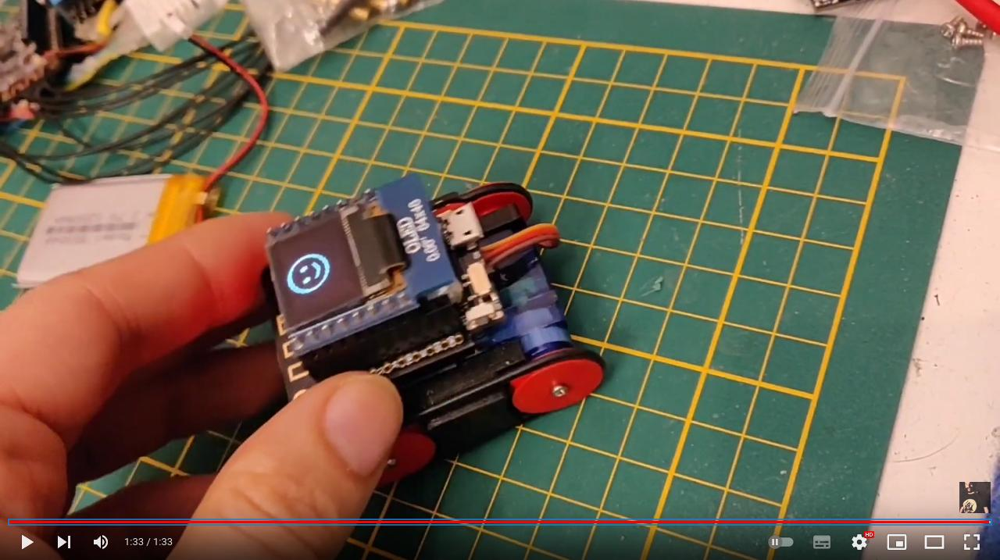

## Mini Tank

ESP32/8266 robot platform using two basic servos. 

## Credits

- 3D Print design and original idea from [Francisco Carabaza @acicuecalo](https://sites.google.com/view/robot-mini-tanque/inicio)
- Icons and graphics [CanAirIO Project](https://github.com/kike-canaries/canairio_firmware#readme)
- Original firmware [AIRobot](https://github.com/hpsaturn/airobot#readme)

## TODO

- [x] Two Joystick flavors (M5StickC and M5StickCPlus)
- [x] Basic emoticons handling
- [x] ESPNow implementation using the [ESPNow Joystick](https://github.com/hpsaturn/espnow-joystick) library
- [x] Servo control improvements. Thanks to @acicuecalo
- [ ] Battery level
- [ ] SPI or I2C connection to MaxiPy nano camera
- [ ] OTA update in boot

## Firmware

You can build and upload it using PlatformIO, with a simple command you upload both, Joysticks and Robot. Connect first the robot board and then the joystick to the USB of your computer and run:

```bash
pio run -e robot --target upload
pio run -e joystickM5StickC --target upload
pio run -e joystickM5StickCPlus --target upload
```
## Components

For 3DPrint files and build instructions and components details [here](https://sites.google.com/view/robot-mini-tanque/inicio)

[)](https://youtu.be/I6cGg1o1NR0 "Joystick WiFi using nanopb (protobuff) over a ESP32 caterpillar")
