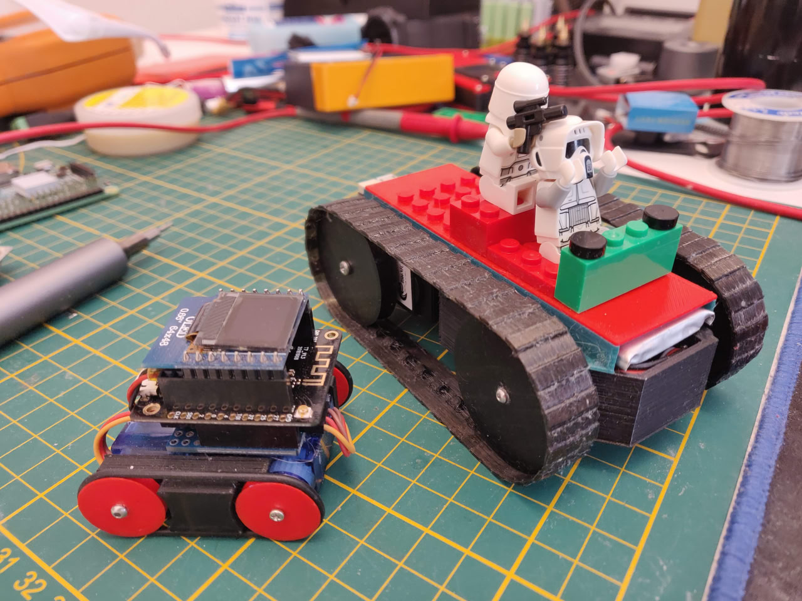

## Mini Tank

ESP32/8266 robot platform using two basic servos (SG90 & MG995)

## TODO

- [x] Unified Joystick, support for M5StickC and M5StickCPlus
- [x] Basic emoticons handling (SG90 version)
- [x] ESPNow implementation using the [ESPNow Joystick](https://github.com/hpsaturn/espnow-joystick) library
- [x] Servo control improvements. Thanks to [@acicuecalo](https://github.com/acicuecalo)
- [x] Slim version design with MG995 motors
- [x] XIAO ESP32S3 MG995 version robot with Camera and LED mini lamp
- [x] Camera streamer via ESPNow using [ESPNowCam Library](https://github.com/hpsaturn/ESPNowCam?tab=readme-ov-file#readme) 
- [x] Added LED flash lamp with ON/OFF via Joystick
- [x] Camera ON/OFF via Joystick
- [x] Unified LED driver, peripherals and servos (All PINs are in the .ini file)
- [ ] Battery level code migration
- [ ] OTA update in boot

## Wiring

The robot in the [video](#3d-printing) has the next alternartive components:

- [ ] TTGO T7 ESP32 Board (is possible Wemos ESP8266, see below)
- [ ] D1 Mini proto PCB (for wire connections and connectors)
- [ ] D1 Mini OLED shield (optional)
- [ ] Two small servos (SG90 or compatible modified to 360¤)
- [ ] LIPO battery of 3.7v
- [ ] Two M3/M2 screws (also with servo screw maybe works)
- [ ] Two Rubber O-Rings Seal 35mm OD 31mm ID 2mm Width

The pins used to connect the servos are: 16,17.

Also can you review the MG995 servos version [here](https://www.thingiverse.com/thing:5974406)

[](https://www.thingiverse.com/thing:5974406)

## Firmware

You can build and upload one of these firmware using PlatformIO, with a simple command you can upload both, the Joysticks or the Robot firmware. Connect first the robot board and then the joystick to the USB of your computer and run some one of this alternatives:

```bash
pio run -e mini-tank --target upload
pio run -e xiao-tank --target upload
pio run -e mg995-red-tank --target upload
pio run -e mg995-black-tank --target upload
pio run -e m5joystick --target upload
```

## 3D Printing

For 3DPrint files, build instructions and components details

- SG90 servos version [here](https://sites.google.com/view/robot-mini-tanque/inicio)
- MG995 servos version [here](https://www.thingiverse.com/thing:5974406)

[](https://youtu.be/I6cGg1o1NR0 "Joystick WiFi using nanopb (protobuff) over a ESP32 caterpillar")

## Credits

- (mini-tank SG90) 3D Print design and original idea from [Francisco Carabaza @acicuecalo](https://sites.google.com/view/robot-mini-tanque/inicio)
- Icons and graphics from [CanAirIO Project](https://github.com/kike-canaries/canairio_firmware#readme)
- Base firmware migrated from [AIRobot](https://github.com/hpsaturn/airobot#readme)